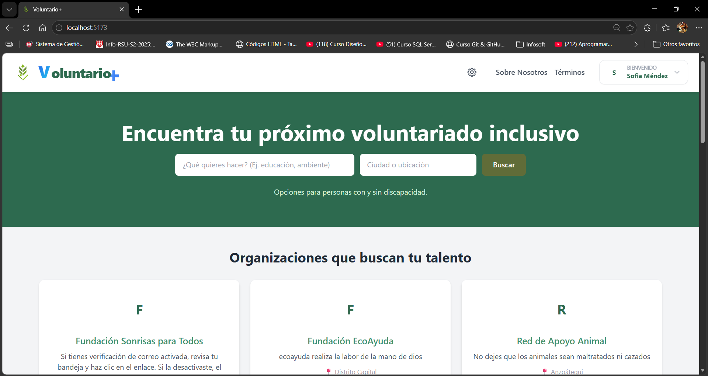
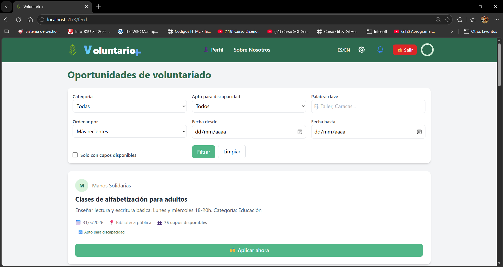
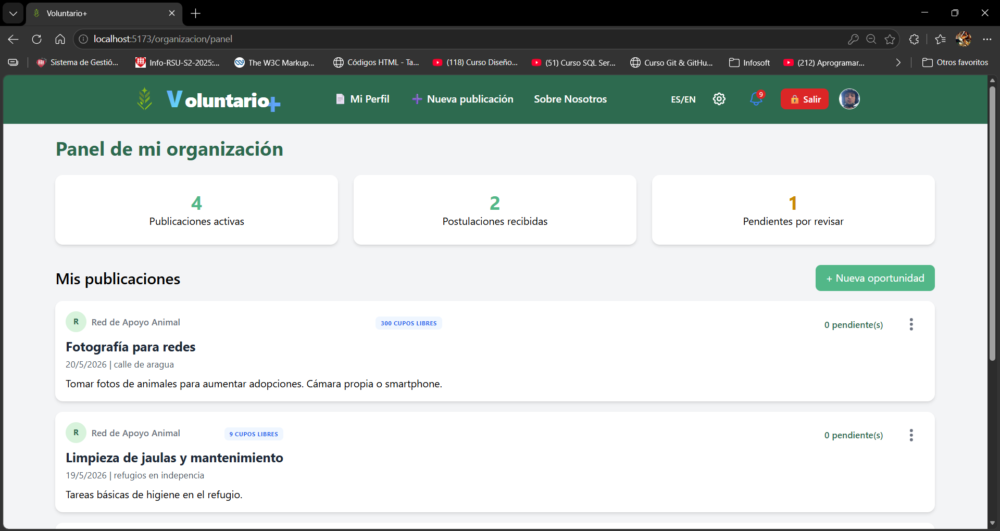
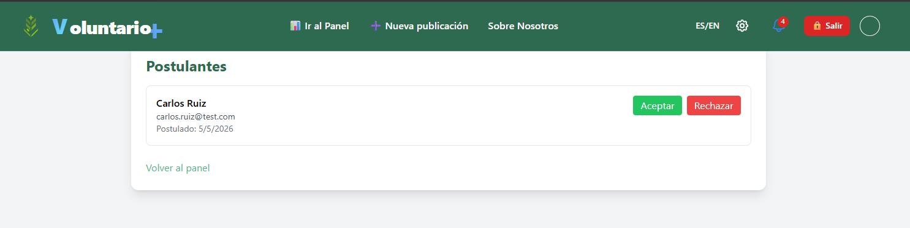
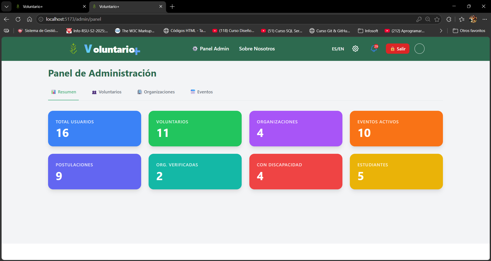

<p align="center">
  
</p>

<h1 align="center">🌱 Voluntario+</h1>

<p align="center">
  <strong>Plataforma web inclusiva para la gestión integral del voluntariado</strong><br/>
  Conecta organizaciones sociales con voluntarios, permite postularse a proyectos, gestionar postulantes, asignar insignias de reconocimiento y generar certificados digitales automáticos.
</p>

<p align="center">
  
  
  
  
  
</p>

---

## 📋 Índice

- [✨ Características principales](#-características-principales)
- [🚀 Tecnologías utilizadas](#-tecnologías-utilizadas)
- [📁 Estructura del proyecto](#-estructura-del-proyecto)
- [📸 Capturas de pantalla](#-capturas-de-pantalla)
- [🧪 Credenciales de prueba](#-credenciales-de-prueba)
- [📦 Instalación y ejecución](#-instalación-y-ejecución)
- [⚙️ Backend – API REST](#️-backend--api-rest)
- [🎨 Frontend – React + Vite](#-frontend--react--vite)
- [🚫 Archivos a ignorar (`.gitignore`)](#-archivos-a-ignorar-gitignore)
- [📄 Licencia](#-licencia)

---

## ✨ Características principales

- **Tres roles diferenciados** – Administrador, organización y voluntario, con paneles específicos y rutas protegidas.
- **Registro inteligente** – Validación de edad mínima (16 años), contraseña segura, reCAPTCHA v2 y verificación de correo electrónico.
- **Feed de oportunidades** – Filtros por categoría, ubicación y apto para discapacidad. Postulación en un solo clic.
- **Panel de organización** – Crear publicaciones, gestionar postulantes (aceptar/rechazar), asignar insignias y completar proyectos.
- **Panel de administración** – Estadísticas globales, activar/desactivar usuarios y verificar organizaciones.
- **Certificados digitales** – Generación automática de PDF con `pdfkit` al completar proyectos (nombre, horas, proyecto, organización).
- **Gamificación** – Sistema de insignias que motiva a los voluntarios (Primera Postulación, Constancia Voluntaria, Inclusión Activa, etc.).
- **Accesibilidad total** – Cumple WCAG 2.1 nivel AA: navegación por teclado, lectores de pantalla (VoiceOver, TalkBack, NVDA) y alto contraste.
- **Seguridad robusta** – JWT, bcrypt, reCAPTCHA, verificación de correo, cierre de sesión por inactividad (10 minutos).

---

## 🚀 Tecnologías utilizadas

| Capa          | Tecnologías                                                                 |
|---------------|-----------------------------------------------------------------------------|
| **Frontend**  | React 18, Vite, React Router, Axios, CSS puro (accesible)                  |
| **Backend**   | Node.js, Express, JWT, bcrypt, Nodemailer, PDFKit                          |
| **Base datos**| MySQL (diseño relacional normalizado)                                      |
| **Seguridad** | reCAPTCHA v2, verificación de correo, cierre de sesión por inactividad     |

---

## 📁 Estructura del proyecto

```text
voluntario-plus/
├── backend/
│   ├── config/ # Configuración (DB, mailer)
│   ├── controllers/ # Lógica de negocio
│   ├── middleware/ # Auth, validaciones
│   ├── models/ # Consultas SQL
│   ├── routes/ # Endpoints de la API
│   ├── utils/ # Funciones auxiliares (pdf, captcha, validadores)
│   ├── .env.example # Plantilla de variables de entorno
│   └── server.js # Punto de entrada
├── frontend/
│   ├── public/ # Índice y recursos estáticos
│   ├── src/
│   │   ├── components/ # Componentes reutilizables por rol
│   │   ├── contexts/ # AuthContext (autenticación global)
│   │   ├── hooks/ # useIdleTimeout, etc.
│   │   ├── pages/ # Páginas públicas (Welcome, AcercaDe)
│   │   ├── services/ # Configuración de Axios
│   │   ├── styles/ # CSS global
│   │   ├── App.jsx
│   │   └── index.jsx
│   ├── package.json
│   └── vite.config.js # Proxy para evitar CORS
├── database/ # Scripts SQL (estructura y datos de prueba)
├── screenshots/ # Capturas de pantalla (para este README)
└── README.md # Este archivo
```


---

## 📸 Capturas de pantalla

> **Nota:** Coloca tus imágenes en la carpeta `screenshots/` y ajusta las rutas según corresponda.

| Página/Sección | Captura |
|----------------|---------|
| **Página de bienvenida** |  |
| **Feed de voluntario** |  |
| **Panel de organización** |  |
| **Gestión de postulantes** |  |
| **Perfil de voluntario (insignias)** |  |
| **Panel de administración** |  |
| **Certificado PDF generado** | <p> en proceso de creacion </p> |

---

## 🧪 Credenciales de prueba

| Rol           | Email                          | Contraseña |
|---------------|--------------------------------|------------|
| Administrador | `admin@voluntario.com`         | `123456`   |
| Organización  | `ambiental@fundacion.org`      | `123456`   |
| Voluntario    | `voluntario.regular@test.com`  | `123456`   |

> ⚠️ **Nota:** Estas credenciales son solo para pruebas locales. En producción deben cambiarse.

---

## 📦 Instalación y ejecución

### Requisitos previos
- **Node.js** (v20 o superior) – [Descargar](https://nodejs.org/)
- **MySQL** (XAMPP, WAMP o standalone) – [Descargar XAMPP](https://www.apachefriends.org/)
- **Git** – [Descargar](https://git-scm.com/)

### Clonar el repositorio
```bash
git clone https://github.com/jaMoco/Voluntario-Plus.git
cd xampp/htdocs/voluntario-plus

Configurar la base de datos
Abre phpMyAdmin (o tu cliente MySQL).
```

## Configurar la base de datos

Crea una base de datos llamada voluntario_plus (utf8mb4_general_ci).

Importa el archivo database/voluntario_plus.sql.

Verifica que las tablas se hayan creado correctamente.

## Backend

cd backend
npm install
cp .env.example .env          # Edita con tus credenciales locales
npm run dev

El backend correrá en http://localhost:5000.

## Frontend

cd frontend
npm install
npm run dev

El frontend correrá en http://localhost:5173.

Abre http://localhost:5173 en tu navegador para empezar.

## ⚙️ Backend – API REST
API RESTful para la plataforma de voluntariado.

Tecnologías backend
Tecnología	Propósito
Express	Framework web para Node.js
MySQL2	Driver con soporte de promesas y pool de conexiones
bcryptjs	Hashing de contraseñas
jsonwebtoken	Autenticación sin estado
Nodemailer	Envío de correos (verificación)
pdfkit	Generación de certificados PDF
dotenv	Variables de entorno

### Variables de entorno (.env)

Copia el archivo `.env.example` a `.env` y completa los valores:

```env
PORT=5000
DB_HOST=localhost
DB_USER=root
DB_PASSWORD=
DB_NAME=voluntario_plus
JWT_SECRET=clave_muy_segura
EMAIL_USER=tu_correo@gmail.com
EMAIL_PASS=contraseña_aplicacion
SMTP_HOST=smtp.gmail.com
SMTP_PORT=587
RECAPTCHA_SECRET=clave_recaptcha
```

### Endpoints principales

| Método | Ruta | Descripción | Acceso |
| :--- | :--- | :--- | :--- |
| **POST** | `/api/auth/registro/voluntario` | Registro de voluntario | Público |
| **POST** | `/api/auth/registro/organizacion` | Registro de organización | Público |
| **POST** | `/api/auth/login` | Inicio de sesión (devuelve JWT) | Público |
| **GET** | `/api/publicaciones` | Lista todas las oportunidades | Público |
| **POST** | `/api/aplicaciones` | Postularse a una oportunidad | Voluntario |
| **GET** | `/api/organizacion/panel` | Panel de organización | Organización |
| **GET** | `/api/admin/panel` | Panel de administración | Admin |
| **POST** | `/api/organizacion/aplicaciones/:id/completar` | Completar proyecto y generar PDF | Organización |

## Seguridad implementada

JWT con expiración de 24h (almacenado en localStorage en el frontend)

bcrypt hashing con 10 rondas

reCAPTCHA v2 en registros

Verificación de correo (token único de 32 bytes, expiración 24h)

Protección de rutas por rol (middleware verificarToken)

Variables de entorno para credenciales sensibles

## Pruebas con curl

# Login
curl -X POST http://localhost:5000/api/auth/login \
  -H "Content-Type: application/json" \
  -d '{"email":"admin@voluntario.com","password":"123456"}'

## 🎨 Frontend – React + Vite

# Interfaz de usuario de la plataforma de voluntariado.

Tecnologías frontend
Tecnología	Propósito
React 18	Biblioteca para interfaces de usuario
Vite	Empaquetador ultrarrápido (HMR, esbuild)
React Router DOM	Navegación SPA
Axios	Cliente HTTP con interceptores
React Hot Toast	Notificaciones accesibles
CSS puro	Estilos modulares por componente (sin frameworks)

# Rutas principales

Ruta	Descripción	Acceso
/	Página de bienvenida (pública)	Todos
/login	Inicio de sesión	Todos
/registro/voluntario	Registro de voluntario	Todos
/registro/organizacion	Registro de organización	Todos
/feed	Feed de oportunidades	Voluntario
/perfil	Perfil del voluntario	Voluntario
/mis-postulaciones	Historial de postulaciones	Voluntario
/mis-certificados	Certificados descargables	Voluntario
/organizacion/panel	Panel de organización	Organización
/organizacion/nueva-publicacion	Crear oportunidad	Organización
/admin/panel	Panel de administración	Admin

## ♿ Accesibilidad (A11y)

El frontend de **Voluntario+** está diseñado bajo principios de inclusión, siguiendo las pautas esenciales de accesibilidad para garantizar una experiencia óptima a todos los usuarios:

* **Atributos ARIA:** Uso estricto de roles y estados (`aria-label`, `role`, `aria-expanded`) en componentes interactivos clave como modales, barras de navegación y menús desplegables.
* **Navegación por Teclado:** Soporte completo para recorrer la aplicación utilizando únicamente las teclas `Tab`, `Enter` y `Espacio`. El indicador de enfoque (`focus outline`) es siempre visible y con alto contraste.
* **Lectores de Pantalla:** Estructura semántica HTML5 optimizada para una correcta interpretación mediante tecnologías de asistencia como *VoiceOver*, *TalkBack* y *NVDA*.
* **Contraste de Color:** Paleta de colores ajustada bajo los criterios de la norma **WCAG 2.1**, garantizando una relación de contraste mínima de `4.5:1` para todo el texto legible.
* **Diseño Elástico:** Escalabilidad tipográfica basada en unidades relativas (`rem`), permitiendo aplicar zoom en el navegador de hasta un 200% sin que se rompa el diseño ni se pierda funcionalidad.

---

## 🔄 Proxy y Variables de Entorno

### Configuración del Proxy (Desarrollo)
Para prevenir conflictos de **CORS** (*Cross-Origin Resource Sharing*) durante el desarrollo local, Vite está configurado para actuar como un proxy inverso hacia el servidor del backend.

**Archivo:** `frontend/vite.config.js`
```javascript
import { defineConfig } from 'vite'
import react from '@vitejs/plugin-react'

// [https://vitejs.dev/config/](https://vitejs.dev/config/)
export default defineConfig({
  plugins: [react()],
  server: {
    proxy: {
      '/api': {
        target: 'http://localhost:5000',
        changeOrigin: true,
        secure: false,
      }
    }
  }
})
```

### Variables de Entorno

Si necesitas parametrizar o cambiar dinámicamente la URL base del backend, puedes controlarlo mediante variables de entorno en el frontend.

1. Crea un archivo `.env` en la raíz de la carpeta `frontend/`:
```env
VITE_API_URL=http://localhost:5000/api
```

2. La configuración centralizada de **Axios** consumirá esta variable automáticamente, utilizando el proxy local como alternativa en caso de que falte:
**Archivo:** `frontend/src/services/api.js`
```javascript
import axios from 'axios'

const api = axios.create({
  baseURL: import.meta.env.VITE_API_URL || '/api'
})

export default api
```

---

## 🚫 Archivos a ignorar (.gitignore)

Para mantener el repositorio limpio y evitar la fuga de información sensible (como credenciales de bases de datos o llaves de correo), asegúrate de crear un archivo `.gitignore` en la **raíz del proyecto** con la siguiente estructura comentada:

```gitignore
# Dependencias de Node (No incluir en el repositorio)
node_modules/
backend/node_modules/
frontend/node_modules/

# Archivos de entorno locales (Contienen credenciales y llaves privadas)
.env
*.env
backend/.env
frontend/.env

# Registros del sistema y depuración (Logs)
*.log
npm-debug.log*
yarn-debug.log*
yarn-error.log*

# Directorios de compilación y producción (Builds)
dist/
build/
frontend/dist/

# Documentos generados de forma local o dinámica
certificados/
*.pdf

# Archivos específicos de entornos de desarrollo (IDE) y SO
.vscode/
.idea/
.DS_Store
Thumbs.db

# Archivos temporales o del sistema de intercambio
*.tmp
*.swp
```
## 📄 Licencia

Este proyecto está bajo la Licencia **MIT**. Puedes consultar el archivo [LICENSE](./LICENSE) para conocer todos los detalles sobre los permisos, condiciones y limitaciones de uso.


---

<p align="center">
  Desarrollado con ❤️ y ☕ por <strong>Jesús Moco</strong> 👨‍💻 — 2026
</p>
